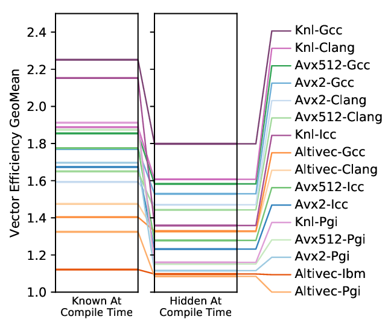

# Auto-vectorization Benchmark through withdrawal of useful information

This Test-Suite evaluates the auto-vectorization capabilities of compilers for
different amounts of compile-time provided information. It contrasts with
traditional test-suites that only provide implementation-specific source to
the compiler. To achieve this we have extended the TSVC benchmark and 6
micro-kernels (Binomial options, Black-Scholes, MandelBrot, Convolutions,
Small matrix-matrix multiplication and Stencil computation) with preprocessor
macros to choose whether the value of:
- Loop bounds
- Parameters in Array Indices and offsets
- Parameters in Conditional Evaluations
- Array attributes such as alignment and non-aliasing constrains
is provided at compile-time or hidden until the run-time.

This code is associated with the paper:
> Sergi Siso, Wes Armour, and Jeyarajan Thiyagalingam. 2019. Evaluating Auto-Vectorizing
> Compilers through Objective Withdrawal of Useful Information. ACM Trans. Archit. Code
> Optim. 16, 4, Article 40 (October 2019), 23 pages.
> DOI:[https://doi.org/10.1145/3356842](https://doi.org/10.1145/3356842)


## Instructions

The repository is structured as follows:

Path                | Description
------------------- | -----------
src/                | Source files of the test suite which inclues the extended TSVC and the micro-kernels.
scripts/            | Scripts to help with the execution of the full suite and the analysis of the results.
results-2019/       | Results associated with the published paper.
license.txt         | Copyright and permission notices
README              | This file

It is possible to compile and run the tests with the `Makefiles` in the `src/`
directory but to facilitate a methodic execution of all tests we recommend to
follow the steps:

1. Generate the TSVC Benchmarks with `scripts/bench.py`. The generation accepts
the following parameters:
```
  -h, --help            show this help message and exit
  --benchmark  [ ...]   Space separated list of case sensitive benchmark
                        names. Allowed values are LINEAR_DEPENDENCE,
                        INDUCTION_VARIABLE, GLOBAL_DATA_FLOW, CONTROL_FLOW,
                        SYMBOLICS, STATEMENT_REORDERING, LOOP_RESTRUCTURING,
                        NODE_SPLITTING, EXPANSION, CROSSING_THRESHOLDS,
                        REDUCTIONS, RECURRENCES, SEARCHING, PACKING,
                        LOOP_REROLLING, EQUIVALENCING, INDIRECT_ADDRESSING,
                        CONTROL_LOOPS
  --compiler {icc,gcc,ibm,clang,pgi}
                        Select compiler
  --parameters {None,RUNTIME_ALL,RUNTIME_ATTRIBUTES,RUNTIME_ARITHMETIC,RUNTIME_INDEX,RUNTIME_CONDITIONS,RUNTIME_LOOP_BOUNDS}
                        Select the parameters provided at run-time
  --isa {knl,avx2,altivec,avx512}
                        Specify vector isa to test
  --results RESULTS     Specify output folder
  --source SOURCE       Specify benchmark source location
  --repeat REPEAT       Repeat each benchmarks the specified number oftimes
```

2. Execute the generated `runall.sh` bash script (or submit it to the target cluster).
3. Execute the micro-kernels with `scripts/runall_microkernels.sh`.
4. Generate analysis plots and tables using `scripts/plotresults.py`.


## Results Summary



## Contributors 
Sergi Siso (sergi.siso@stfc.ac.uk)
Jeyan Thiyagalingam (t.jeyan@stfc.ac.uk)

This project incorporates and extends work (see [license.txt](license.txt)) from:
- https://github.com/llvm-mirror/test-suite/blob/master/MultiSource/Benchmarks/TSVC
- https://github.com/ispc/ispc/master/examples
